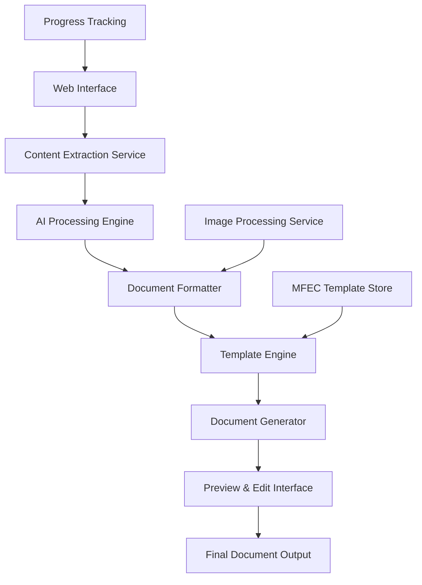

# Design Document

## Overview

The Thai Document Generator is a web-based application that automatically creates professional Thai user manuals and product documents following MFEC's format standards. The system leverages LLM technology to extract, translate, organize, and format content from product links while maintaining source attribution and ensuring high-quality document output.

The application follows a pipeline architecture where content flows through extraction, AI processing, formatting, and generation stages. Each stage is designed to be modular and extensible, allowing for future enhancements and different document types.

## Architecture

### High-Level Architecture



### System Components

1. **Web Interface Layer**: User-facing interface for input, preview, and download
2. **Content Extraction Service**: Handles URL processing and content extraction
3. **AI Processing Engine**: LLM integration for translation and content organization
4. **Document Formatter**: Applies MFEC standards and organizes content structure
5. **Template Engine**: Manages MFEC format templates using official assets from `.qodo/Template/`
6. **Image Processing Service**: Handles image extraction, optimization, and placement
7. **Document Generator**: Creates final documents in various formats using MFEC templates
8. **Progress Tracking System**: Provides real-time feedback to users
9. **MFEC Asset Manager**: Handles official MFEC brand assets, logos, and template files

## Components and Interfaces

### 1. Web Interface Component

**Purpose**: Provides user interaction and document preview capabilities

**Key Interfaces**:
- `DocumentGenerationRequest`: Handles user input and configuration
- `PreviewInterface`: Displays generated content for review
- `ProgressTracker`: Shows real-time generation status

**Responsibilities**:
- Accept product URLs and document type selection
- Display progress feedback during generation
- Provide preview and editing capabilities
- Handle document download and export

### 2. Content Extraction Service

**Purpose**: Extracts and preprocesses content from product URLs

**Key Interfaces**:
- `URLProcessor`: Validates and processes input URLs
- `ContentExtractor`: Extracts text, images, and metadata
- `ContentValidator`: Ensures extracted content quality

**Responsibilities**:
- Validate and process various URL formats
- Extract text content, images, and product information
- Handle different website structures and formats
- Provide error handling for inaccessible content

### 3. AI Processing Engine

**Purpose**: Handles LLM integration for content translation and organization with secure API key management

**Key Interfaces**:
- `LLMConnector`: Manages secure LLM API connections to MFEC's LiteLLM endpoint
- `ContentProcessor`: Handles translation and content organization
- `QualityAssurance`: Validates AI-generated content quality
- `SecureConfigManager`: Manages API keys and sensitive configuration

**Responsibilities**:
- Translate content to natural Thai language using MFEC's LLM endpoint
- Intelligently organize and structure content
- Refine and polish content for professional presentation
- Ensure content coherence and logical flow
- Securely manage API keys and authentication

### 4. Document Formatter

**Purpose**: Applies MFEC formatting standards and document structure

**Key Interfaces**:
- `MFECFormatter`: Applies MFEC-specific formatting rules
- `ContentOrganizer`: Structures content into appropriate sections
- `StyleApplicator`: Handles fonts, spacing, and visual elements

**Responsibilities**:
- Apply MFEC format standards consistently
- Organize content into proper document sections
- Handle different document types (user manual vs product document)
- Integrate images appropriately within content

### 5. Template Engine

**Purpose**: Manages MFEC document templates and styling using official MFEC assets

**Key Interfaces**:
- `TemplateManager`: Loads and manages MFEC templates from `.qodo/Template/`
- `StyleRenderer`: Applies styling based on MFEC Brand Guideline
- `LayoutEngine`: Handles document layout using MFEC_System&User_Manual_Template.docx
- `BrandAssetManager`: Manages MFEC logos and brand elements

**Responsibilities**:
- Load MFEC_System&User_Manual_Template.docx as base template
- Apply styling according to ENG_MFEC Brand Guideline
- Integrate appropriate MFEC logos (standard, white, or AI versions)
- Handle headers, footers, and standard MFEC elements
- Maintain consistent branding per official guidelines

### 6. Image Processing Service

**Purpose**: Handles image extraction, optimization, and document integration

**Key Interfaces**:
- `ImageExtractor`: Extracts images from source URLs
- `ImageOptimizer`: Optimizes images for document inclusion
- `ImagePlacer`: Determines optimal image placement in documents

**Responsibilities**:
- Extract relevant images from product pages
- Optimize image size and quality for documents
- Determine appropriate image placement within content
- Handle image fallbacks and placeholders

## Data Models

### DocumentRequest
```typescript
interface DocumentRequest {
  productUrl: string;
  documentType: 'user_manual' | 'product_document';
  language: 'thai';
  mfecTemplate: string;
  includeImages: boolean;
  customInstructions?: string;
}
```

### ExtractedContent
```typescript
interface ExtractedContent {
  url: string;
  title: string;
  contentType: 'website' | 'youtube_video';
  textContent: string;
  videoContent?: VideoContent; // For YouTube videos
  images: ImageData[];
  metadata: ContentMetadata;
  extractionTimestamp: Date;
}
```

### VideoContent
```typescript
interface VideoContent {
  videoId: string;
  duration: number;
  transcript: string;
  keyMoments: VideoMoment[];
  screenshots: VideoScreenshot[];
  audioAnalysis?: AudioAnalysis;
}
```

### VideoMoment
```typescript
interface VideoMoment {
  timestamp: number;
  description: string;
  importance: 'high' | 'medium' | 'low';
  actionType: 'step' | 'explanation' | 'demonstration' | 'result';
  screenshot?: string;
}
```

### VideoScreenshot
```typescript
interface VideoScreenshot {
  timestamp: number;
  imageUrl: string;
  caption: string;
  relevanceScore: number;
  associatedStep?: string;
}
```

### ProcessedContent
```typescript
interface ProcessedContent {
  translatedContent: string;
  organizedSections: DocumentSection[];
  refinedContent: string;
  sourceAttribution: SourceInfo;
  qualityScore: number;
}
```

### DocumentSection
```typescript
interface DocumentSection {
  id: string;
  title: string;
  content: string;
  subsections: DocumentSection[];
  images: ImagePlacement[];
  sectionType: 'introduction' | 'features' | 'installation' | 'usage' | 'troubleshooting' | 'specifications';
}
```

### MFECTemplate
```typescript
interface MFECTemplate {
  templatePath: string; // Path to MFEC_System&User_Manual_Template.docx
  brandGuidelinePath: string; // Path to ENG_MFEC Brand Guideline
  logoAssets: {
    standard: string; // Logo MFEC.png
    white: string; // Logo MFEC White.png
    ai: string; // Logo MFEC More. 2023ai.ai
  };
  documentType: 'system_manual' | 'user_manual';
  styleSettings: BrandStyleSettings;
}
```

### BrandStyleSettings
```typescript
interface BrandStyleSettings {
  primaryColors: string[];
  fonts: FontSettings;
  spacing: SpacingSettings;
  headerFooterSettings: HeaderFooterConfig;
  logoPlacement: LogoPlacementConfig;
}
```

### LLMConfiguration
```typescript
interface LLMConfiguration {
  baseUrl: string; // https://gpt.mfec.co.th/litellm
  apiKeyRef: string; // Reference to secure storage, not the actual key
  chatModel: string; // gpt-4o for content generation and chatbot
  embeddingModel: string; // text-embedding-3-large for RAG system
  maxTokens: number;
  temperature: number;
  timeout: number;
}
```

### SecureConfig
```typescript
interface SecureConfig {
  llmApiKey: string; // Stored securely, never in code
  userApiKey?: string; // Optional user-provided API key for fallback
  encryptionKey: string;
  environment: 'development' | 'staging' | 'production';
}
```

### APIKeyManager
```typescript
interface APIKeyManager {
  primaryKey: string; // Main MFEC API key
  fallbackKey?: string; // User-provided key when primary is exhausted
  keyStatus: 'active' | 'exhausted' | 'invalid';
  validateKey(key: string): Promise<boolean>;
  switchToFallback(): void;
  resetToPrimary(): void;
}
```

### GeneratedDocument
```typescript
interface GeneratedDocument {
  id: string;
  title: string;
  content: ProcessedContent;
  template: MFECTemplate;
  sourceAttribution: SourceInfo;
  generationMetadata: GenerationInfo;
  previewUrl: string;
  downloadFormats: string[];
}
```

## Security Considerations

### API Key Management
- **Environment Variables**: Store API keys in environment variables, never in code
- **Secure Configuration**: Use `.env` files for local development (excluded from version control)
- **Production Security**: Use secure key management services in production
- **Key Rotation**: Support for API key rotation without application restart
- **Access Control**: Limit API key access to authorized components only

### Configuration Security
```typescript
// Example secure configuration loading
const config = {
  llm: {
    baseUrl: process.env.MFEC_LLM_BASE_URL || "https://gpt.mfec.co.th/litellm",
    apiKey: process.env.MFEC_LLM_API_KEY, // Never hardcode
    model: process.env.MFEC_LLM_MODEL || "gpt-4",
  }
};
```

### Security Best Practices
- Use HTTPS for all API communications
- Implement request rate limiting
- Validate and sanitize all user inputs
- Log security events without exposing sensitive data
- Regular security audits of dependencies

## Error Handling

### Error Categories

1. **URL Processing Errors**
   - Invalid URL format
   - Inaccessible content
   - Blocked or restricted access
   - Network connectivity issues

2. **Content Extraction Errors**
   - Insufficient content found
   - Unsupported content format
   - Content parsing failures
   - Image extraction failures

3. **AI Processing Errors**
   - MFEC LLM API failures or authentication issues
   - Translation quality issues
   - Content organization failures
   - Rate limiting or quota exceeded
   - API key validation failures

4. **Document Generation Errors**
   - Template application failures
   - Formatting errors
   - Image integration issues
   - Export format problems

### Error Handling Strategy

- **Graceful Degradation**: Provide alternative options when primary methods fail
- **User Feedback**: Clear error messages with actionable suggestions
- **Retry Mechanisms**: Automatic retry for transient failures
- **Fallback Options**: Manual content input when automatic extraction fails
- **Progress Preservation**: Save progress to allow recovery from failures

## Testing Strategy

### Unit Testing
- Test individual components in isolation
- Mock external dependencies (LLM APIs, web scraping)
- Validate data transformations and formatting logic
- Test error handling scenarios

### Integration Testing
- Test component interactions and data flow
- Validate end-to-end document generation process
- Test with various URL formats and content types
- Verify MFEC formatting compliance

### User Acceptance Testing
- Test with real product URLs and content
- Validate Thai language quality and naturalness
- Verify document formatting meets MFEC standards
- Test user interface usability and workflow

### Performance Testing
- Test with large content volumes
- Validate response times for document generation
- Test concurrent user scenarios
- Monitor resource usage and optimization

### Quality Assurance Testing
- Validate translation accuracy and naturalness
- Verify content organization and flow
- Test source attribution accuracy
- Ensure consistent MFEC formatting application

### Test Data Strategy
- Create test product URLs with known content
- Develop MFEC format validation test cases using official template
- Build Thai language quality assessment criteria
- Establish performance benchmarks and thresholds
- Validate against actual MFEC_System&User_Manual_Template.docx structure
- Test brand guideline compliance using ENG_MFEC Brand Guideline
- Verify logo integration with all available MFEC logo assets